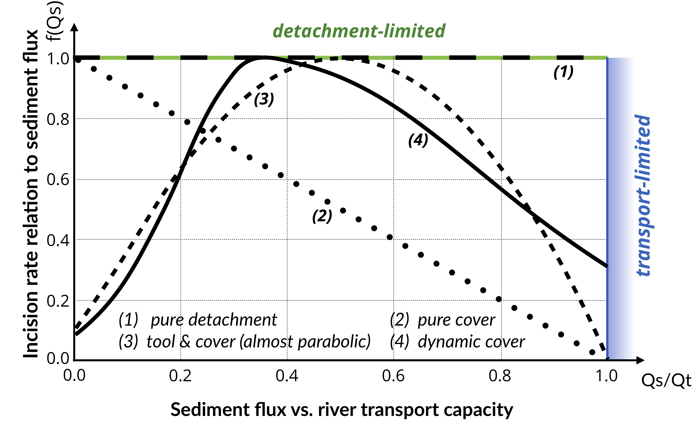
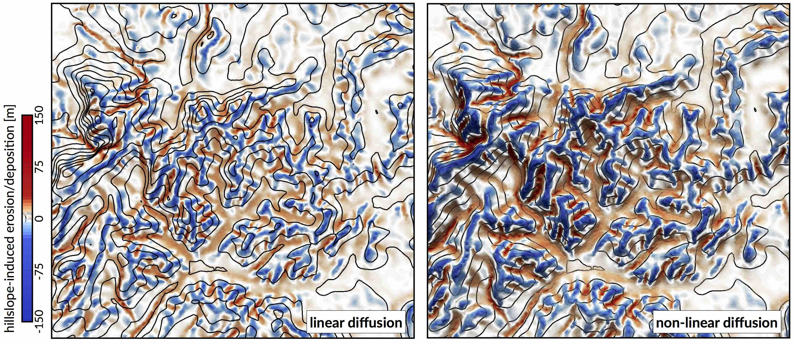
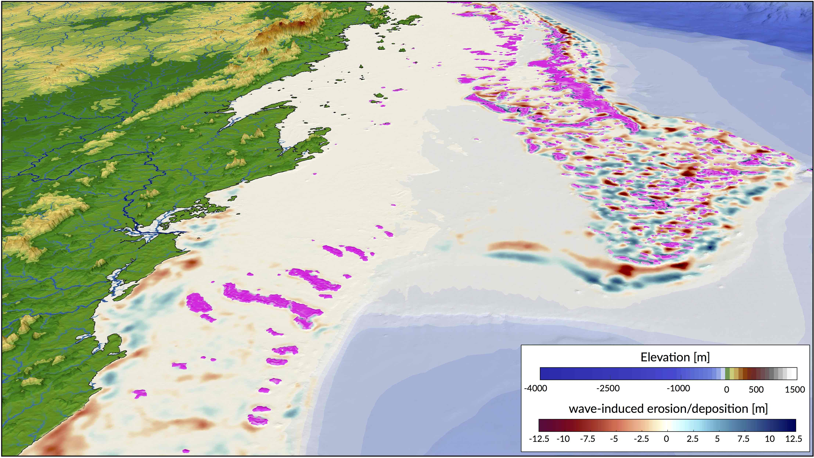

###################
Simulated Processes
###################

Over the last decades, many numerical models have been proposed to simulate how the Earth surface has evolved over geological time scales in response to different driving mechanisms such as tectonics or climatic variability [1]_ [2]_ [3]_ [4]_ [5]_. These models combine empirical data and conceptual methods into a set of mathematical equations that can be used to reconstruct landscape evolution and associated sediment fluxes [6]_ [7]_. They are currently used in many research fields such as hydrology, soil erosion, hillslope stability and general landscape studies.

.. figure:: img/intro.jpg
   :scale: 50 %
   :alt: capability
   :align: center

   A schematic of our model illustrating the main variables and forcing conditions. **w** represents the wave boundary conditions, **ld** the longshore drift, **sl** the sea-level, **u** the tectonic, **f** the flexural isostasy and **r** the rainfall patterns. The stratigraphic evolution and morphology are computed through time.

Numerous models have focused on the erosional processes especially in the case of river dynamics [8]_ [9]_ [10]_ [11]_ [7]_ yet much less work has been done to simulate regional to continental depositional systems and associated stratigraphic evolution in sedimentary basins [6]_ [12]_. In addition and with a few exceptions [13]_ [14]_ [15]_ most of these models have either been limited to one part of the sediment routing system (*e.g.*, fluvial geomorphology, coastal erosion, carbonate platform development) or built upon simple laws commonly derived from diffusion-based equations which applications require pluri-kilometric spatial resolution [16]_. These limitations often restrict our understanding of sediment fate from source to sink. It also makes it difficult to link site-specific observations to numerical model outputs.

**Badlands** framework and the development efforts behind it are intended to address these shortcomings. It provides a more direct and flexible description of the inter-connectivities between land, marine and reef environments, in that it explicitly links these systems together (Fig 1). As mentioned above, the focus of **badlands** [17]_ is primarily on the description of Earth surface evolution and sedimentary basins formation over regional to continental scale and geological time (thousands to millions of years). **Badlands**, introduced herein, is view as an integrative framework that provides a simple and adaptable numerical tool to explore Earth surface dynamics and quantify the feedback mechanisms between *climate*, *tectonics*, *erosion* and *sedimentation*.

.. figure:: img/component.png
   :scale: 33 %
   :alt: capability
   :align: center

   Main components of **badlands** workflow.

**Badlands** uses a triangular irregular network (**TIN**) to solve the geomorphic equations presented below [18]_. The continuity equation is defined using a finite volume approach and relies on the method described in Tucker et al. [19]_. Fig 2 illustrates the relationships between the different components of the framework.

Fluvial system
--------------

   Model space for stream power-based incision laws. It shows the dependence of river incision rate on sediment flux (adapted from Hobley et al. [7]_).

To solve channel incision and landscape evolution, the algorithm follows the O(n)-efficient ordering method from Braun and Willett [20]_ and is based on a single-flow-direction (**SFD**) approximation assuming that water goes down the path of the steepest slope [21]_.

Several formulations of river incision have been proposed to account for long term evolution of fluvial system [2]_, [22]_. These formulations describe different erosional behaviours ranging from detachment limited, governed by bed resistance to erosion, to transport limited, governed by flow capacity to transport sediment available on the bed. Mathematical representation of erosion process in these formulations is often assumed to follow a stream power law [15]_. These relatively simple approaches have two main advantages. First, they have been shown to approximate the first order kinematics of landscape evolution across geologically relevant timescales (:math:`>{10}^4` years). Second, neither the details of long term catchment hydrology nor the complexity of sediment mobilisation dynamics are required. Below, we present the *six incision laws* currently available in **badlands** (Fig 3).

Detachment-limited model
^^^^^^^^^^^^^^^^^^^^^^^^

.. math::
   \dot{\epsilon}=\kappa_{d} P^l (PA)^m S^n

:math:`\kappa_{d}` is a dimensional coefficient describing the erodibility of the channel bed as a function of rock strength, bed roughness and climate, :math:`l`, :math:`m` and :math:`n` are dimensionless positive constants. Default formulation assumes :math:`l = 0`, :math:`m = 0.5` and :math:`n = 1`. The precipitation exponent :math:`l` allows for representation of climate-dependent chemical weathering of river bed across non-uniform rainfall [23]_.

Transport-limited model
^^^^^^^^^^^^^^^^^^^^^^^

Here, volumetric sediment transport capacity (:math:`Q_t`) is defined using a power law function of unit stream power:

.. math::
   Q_t=\kappa_{t} (PA)^{m_t} S^{n_t}

where :math:`\kappa_{t}` is a dimensional coefficient describing the transportability of channel sediment and :math:`m_t` and :math:`n_t` are dimensionless positive constants. In Eq 2, the threshold of motion (the critical shear stress) is assumed to be negligible [24]_.

.. figure:: img/fig3_1.jpg
   :scale: 10 %
   :alt: capability
   :align: center

   Illustration of the impact of detachment versus transport limited (tool & cover option) formulations on landscape dynamics. The surface shows the evolution of the drainage system of an uplifted surface composed of an island and a plateau at 5 and 9 Ma.

An additional term is now introduced in the stream power model:

.. math::
  \dot{\epsilon}=\kappa f(Q_s) (PA)^m S^n

with :math:`f(Q_{s})` representing a variety of plausible models for the dependence of river incision rate on sediment flux (Fig 3). In the standard detachment-limited, :math:`f(Q_{s})` is equal to unity, which corresponds to cases where :math:`Q_{s} \ll Q_{t}`. Where sediment flux equals or exceeds transport capacity (:math:`Q_s/Q_t \ge 1`) the system is by definition transport-limited (and  depositional if :math:`Q_s/Q_t > 1`).

+------------------------------+
| Linear decline               |
+------------------------------+

This model assumes that stream incision potential decreases linearly from a maximum where there is negligible sediment flux to zero where sediment flux equals transport capacity (Fig 3 - option 2). Conceptually, this law mimics the transfer of stream energy from erosion to transport processes [1]_:

.. math::
  f(Q_s)=1-\frac{Q_s}{Q_t}

+------------------------------+
| Almost parabolic             |
+------------------------------+

Both qualitative and experimental observations have shown that sediment flux has a dual role in the erosion process. First, when sediment flux is low relative to capacity, erosion potential increases with sediment flux (tool effect: bedrock abrasion and plucking). Then, with increased sediment flux, erosion is inhibited (cover effect: sediments protect the bed from impacts by saltating particles). Following Gasparini et al. [25]_, we adopt a parabolic form that reaches a maximum at :math:`Q_s/Q_t = 1/2` [26]_ [27]_ (Fig 3 - option 3, Fig 4):

.. math::
  \begin{eqnarray}
   	f(Q_s)=1-4\left(\frac{Q_s}{Q_t}-0.5\right)^2 \,\,\,\, \mathrm{if} \,\,\,\, Q_s/Q_t >0.1, \nonumber \\
     f(Q_s)=2.6 \frac{Q_s}{Q_t}+0.1 \,\,\,\, \mathrm{if} \,\,\,\, Q_s/Q_t \leq 0.1
  \end{eqnarray}

+------------------------------+
| Dynamic cover                |
+------------------------------+

To account for sediment and spatial heterogeneity of the armouring of the bed, Turowski et al. [11]_ proposed a modified form of the *Almost parabolic* model that better estimates the original Sklar and Dietrich [10]_ experiments (Fig 3 - option 4). It takes the form of two combined Gaussian functions:

.. math::
  f(Q_s)=\exp \left[ - \left(\frac{Q_s/Q_t-0.35}{C_h}\right)^2  \right]

where :math:`C_h` is set to 0.22 for :math:`Q_s/Q_t \leq 0.35` and 0.6 when :math:`Q_s/Q_t > 0.35`.

+------------------------------+
| Saltation abrasion           |
+------------------------------+

Sklar & Dietrich [26]_ [28]_ proposed also a formulation for tool and cover mechanisms which relates bedrock incision to abrasion of saltating bed load. The expression shares the same form as the sediment flux–dependent incision rule presented by Whipple & Tucker [1]_ (Eq 3) with significantly different exponent values:

.. math::
  \dot{\epsilon}=\kappa_{sa} f(Q_s) A^{-0.25} S^{-0.5}

in which the dependence of incision rate to sediment flux is defined as:

.. math::
  f(Q_s)=\frac{Q_s}{W} \left(1-\frac{Q_s}{Q_t}\right)

where :math:`W` represents the channel width and is expressed as a power law relation between width and discharge :math:`W=\kappa_w A^b`.

+------------------------------+
| Abrasion incision            |
+------------------------------+

Parker [29]_ presented an incision model in which two processes dominate erosion of the channel bed: plucking of bedrock blocks and abrasion by saltating bed load. The approach takes the following form:

.. math::
  \dot{\epsilon}=\kappa_{ai}\frac{Q_s}{W} \left(1-\frac{Q_s}{Q_t}\right)

where the only difference with the saltation-abrasion model is in the exponents on both the discharge and slope which are set to zero.

Hillslope processes
-------------------

Along hillslopes, we assume that gravity is the main driver for transport and state that the flux of sediment is proportional to the gradient of topography (Fig 5).

   Erosion/deposition induced after 130 ka of hillslope processes using the linear and non-linear formulations. Left: Linear diffusion produces convex upward slopes (:math:`\kappa_{hl}=\kappa_{hn}=0.05`). Right: non-linear approach tends to have convex to planar profiles as hillslope processes dominate when slopes approach or exceed the critical slope (:math:`S_c = 0.8`) [30]_ [31]_.

One can choose between 2 options to simulate these processes. In the first, we use a linear diffusion law commonly referred to as soil creep [32]_ [33]_:

.. math::
  \frac{\partial z}{\partial t}= \kappa_{hl} \nabla^2 z

in which :math:`\kappa_{hl}` is the diffusion coefficient and can be defined with different values for the marine and land environments. It encapsulates, in a simple formulation, processes operating on superficial sedimentary layers. Main controls on variations of :math:`\kappa_{hl}` include substrate, lithology, soil depth, climate and biological activity.

Field evidence, however, suggests that the linear diffusion approximation (Eq 10) is only rarely appropriate [34]_ [35]_ [30]_ [31]_. Instead, Andrews and Bucknam [36]_ and Roering et al. [37]_ [38]_ proposed a nonlinear formulation of diffusive hillslope transport, assuming that flux rates increase to infinity if slope values approach a critical slope :math:`S_c`. This alternative formulation is available as a second option and takes the following form in our model:

.. math::
  \frac{\partial z}{\partial t}= \nabla \cdot  \frac{\kappa_{hn} \nabla z}{1-(|\nabla z|/S_c)^2}

Wave-induced longshore drift
----------------------------

We adopt the most basic known principles of wave motion, *i.e.*, the linear wave theory [39]_ [40]_. Wave celerity :math:`c` is governed by:

.. math::
  c=\sqrt{\frac{g}{\kappa}\tanh{\kappa d}}

where :math:`g` is the gravitational  acceleration, :math:`\kappa` the radian wave number (equal to :math:`2\pi/L`, with :math:`L` the wave length), and :math:`d` is the water depth. In deep  water, the celerity is dependent only on wave length (:math:`\sqrt{gL/2\pi}`); in shallow water, it depends on depth (:math:`\sqrt{gd}`). From wave celerity and wave length, we calculate wave front propagation (including refraction) using the Huygens principle [41]_. From this, we deduce the wave travel time and define wave directions from lines perpendicular to the wave front. Wave height (:math:`H`) is then calculated along wave front propagation. The algorithm takes into account wave energy dissipation in shallow environment as well as wave-breaking conditions.

Wave-induced sediment transport is related to the maximum bottom wave-orbital velocity :math:`u_{w,b}`. Assuming the linear shallow water approximation [42]_, its expression is simplified as:

.. math::
  u_{w,b}=(H/2)\sqrt{g/d}

Under pure waves (*i.e.*, no superimposed current), the wave-induced bed shear stress :math:`\tau_w` is typically defined as a quadratic bottom friction [43]_:

.. math::
  \tau_{w}=\frac{1}{2}\rho f_w u_{w,b}^2

with :math:`\rho` the water density and :math:`f_w` is the wave friction factor. Considering that the wave friction factor is only dependent of the bed roughness :math:`k_b` relative to the wave-orbital semi-excursion at the bed :math:`A_b` [44]_, we define:

.. math::
  f_w=1.39\left(A_b/k_b\right)^{-0.52}

where :math:`A_b=u_{w,b}T/2\pi` and :math:`k_b=2\pi d_{50} / 12`, with :math:`d_{50}` median sediment grain-size at the bed and :math:`T` the wave period.

For each wave condition, the wave transformation model computes wave characteristics and the induced bottom shear stress. These parameters are subsequently used to evaluate the long-term sediment transport active over the simulated region.

We assume that flow circulation is mainly driven by waves and other processes such as coastal upwelling, tidal, ocean or wind-driven currents are ignored. The proposed method consists in producing *snapshots* of wave-driven circulation distribution resulting from series of deep-water wave scenarios by computing time-averaged longshore current. In nearshore environments, longshore current runs parallel to the shore and significantly contributes to sediment transport [45]_ [46]_. The longshore current velocity (:math:`\vec{v_l}`) in the middle of the breaking zone is defined by Komar & Miller [47]_:

   Example of cumulative wave-induced erosion/deposition during a transgression event (simulated time: 14 ka). Wave-induced shear stress and associated longshore sediment transport are evaluated every 50 years. Pink patches show location of produced coral reefs.

.. math::
  \vec{v_l} = \kappa_l u_{w,b} cos(\theta) sin(\theta) \vec{k}

with :math:`\theta` the angle of incidence of the incoming waves, :math:`\kappa_l`  a scaling parameter and :math:`\vec{k}` the unit vector parallel to the breaking depth contour.

In regions where wave-induced shear stress (Eq 14) is greater than the critical shear stress [48]_ derived from the Shields parameter (:math:`\tau_c = \theta_c gd_{50}(\rho_s-\rho_w)`), bed sediments are entrained. The erosion thickness :math:`h_e` is limited to the top sedimentary layer and for simplicity is assumed to follow a logarithmic form [49]_:

.. math::
  h_e = C_e \ln(\tau_w/\tau_c) \text{ where } \tau_w > \tau_c

where :math:`C_e` is an entrainment coefficient controlling the relationship between shear stress and erosion rate [50]_. Once entrained, sediments are transported following the direction of longshore currents and are deposited in regions where :math:`\tau_{w}<\tau_c` [51]_ (Fig 6).

Carbonate production
--------------------

The organisation of coral reef systems is known to be large and complex and we are still limited in our understanding of their temporal and spatial evolution [52]_. Additionally, most datasets of carbonate systems are often linguistic, context-dependent, and based on measurements with large uncertainties. Alternative approaches, such as fuzzy logic or cellular automata algorithms, have proven to be viable options to simulate these types of system [53]_ [54]_ [55]_. Fuzzy logic methods are able to create logical propositions from qualitative data by using linguistic logic rules and *fuzzy sets* [56]_. These fuzzy sets are defined with continuous boundaries rather than crisp discontinuous ones often used in conventional methods [57]_.

Based on a fuzzy logic approach, carbonate system evolution in **badlands** is driven entirely by a set of rules whose variables are fully adjustable. The utility and effectiveness of the approach is mostly based on the user’s understanding of the modelled carbonate system [14]_. The technique is specifically useful to understand how particular variable, in isolation or in combination with other factors, influences carbonate depositional geometries and reef adaptation (Fig 7).

.. figure:: img/fig6_2.jpg
   :scale: 30 %
   :alt: capability
   :align: center

   Diagram of fuzzy logic process used to evaluate a specific coral assemblage growth rate.

Here, carbonate growth depends on three types of control variables: depth (or accommodation space), wave energy (derived from ocean bottom orbital velocity) and sedimentation rate. For each of these variables, one can define a range of fuzzy sets using membership functions [56]_. A membership function is a curve showing the degree of truth (*i.e.* ranging between 0 and 1) of membership in a particular fuzzy set (Fig 7). These curves can be simple triangles, trapezoids, bell-shaped curves, or have more complicated shapes as shown in Fig 7.

Production of any specific coral assemblage is then computed from a series of fuzzy rules. A fuzzy rule is a logic *if-then* rule defined from the fuzzy sets [53]_. Here, the combination of the fuzzy sets in each fuzzy rule is restricted to the and operator. The amalgamation of competing fuzzy rules is usually referred to as a fuzzy system. Summation of multiple rules from the fuzzy system by truncation of the membership functions produces a fuzzy answer in the form of a membership set (Fig 7). The last step consists in computing a single number for this fuzzy set through *defuzzification* [58]_. In our approach, the centroid (centre of gravity) for the area below the membership set is taken as the *defuzzified* output value. The process returns a *crisp* value of coral assemblage growth on each cell of the simulated region (Fig 6).

Extrinsic forcing
-----------------

Over geological time scales, sediment transport from source to sink is primarily controlled by climate, tectonics and eustatism (Fig 1). In **badlands**, the following set of external forcing mechanisms could be considered:

1. sea-level fluctuations,
2. subsidence, uplift and horizontal displacements,
3. rainfall regimes and
4. boundary wave conditions.

+------------------------------+
| Tectonic forcing             |
+------------------------------+

Tectonic forcing is driven by series of temporal maps. Each map can have variable spatial cumulative displacements making it possible to simulate complex 3D tectonic evolution with both vertical (uplift and subsidence) and horizontal directions. When 3D deformations is imposed, the model uses the node refinement technique proposed by Thieulot et al. [59]_. The geometry of the surface is first advected by tectonic forces before being modified by surface processes. Due to tectonic advection, the density of the nodes evolves over time, which could lead to unbalanced resolutions with places showing either rarefaction or accumulation of nodes. To limit this effect, the advected surface is modified by adding or removing nodes to ensure homogeneous nodes distribution.

+------------------------------+
| Sea-level curves             |
+------------------------------+

Sea-level elevation through time can be imposed from either a published eustatic curve [60]_ [61]_ or directly defined by the user.

+--------------------------------------+
| Temporal variations in precipitation |
+--------------------------------------+

Precipitation might be applied either as a constant values (metres per year) or a set of maps representing spatially changing rainfall regimes. In addition, to account for the interactions between rainfall and topography, the option is given to use the orographic precipitation linear model from Smith & Barstad [62]_. As an example, the coupled evolution of precipitation patterns and topography can be use to quantify the relative importance of climate, erosion and tectonic in mountain geomorphology.

+------------------------------+
| Wave conditions              |
+------------------------------+

To evaluate marine sediment transport over several thousands of years, the approach taken here relies on stationary representation of prevailing fair-weather wave conditions. The wave transformation model is generally performed for time intervals varying from 5 to 50 years. The aim is to simulate realistic wave fields by imposing a sequence of wave forcing conditions. At any given time interval, we define a percentage of activity for each deep-water wave conditions as well as the significant wave height. Then, the bathymetry is used to compute associated wave parameters.

.. important::
  The forcing mechanisms described above will directly control the evolution of sediment transport, associated stratal architecture as well as carbonate production.

----------

.. [1] K. X. Whipple and G. E. Tucker -
  Implications of sediment-flux-dependent river incision models for landscape evolution, Journal of Geophysical Research: Solid Earth, vol. 107, no. B2, pp. 1–20, 2002.

.. [2] G. E. Tucker and G. R. Hancock -
  Modelling landscape evolution, Earth Surface Processes and Landforms, vol. 35, no. 1, pp. 28–50, 2010.

.. [3] T. Salles and L. Hardiman -
  Badlands: An open-source, flexible and parallel framework to study landscape dynamics, Computers & Geosciences, vol. 91, no. Supplement C, pp. 77–89, 2016.

.. [4] B. Campforts, W. Schwanghart, and G. Govers -
  Accurate simulation of transient landscape evolution by eliminating numerical diffusion: the TTLEM 1.0 model, Earth Surface Dynamics, vol. 5, no. 1, pp. 47–66, 2017.

.. [5] J. M. Adams, N. M. Gasparini, D. E. J. Hobley, G. E. Tucker, E. W. H. Hutton, S. S. Nudurupati, and E. Istanbulluoglu -
  The landlab v1.0 overlandflow component: a python tool for computing shallow- water flow across watersheds, Geoscientific Model Development, vol. 10, no. 4, pp. 1645–1663, 2017.

.. [6] A. D. Howard, W. E. Dietrich, and M. A. Seidl -
  Modeling fluvial erosion on regional to continental scales, Journal of Geophysical Research: Solid Earth, vol. 99, no. B7, pp. 13971–13986, 1994.

.. [7] D. E. J. Hobley, H. D. Sinclair, S. M. Mudd, and P. A. Cowie -
 Field calibration of sediment flux dependent river incision, Journal of Geophysical Research: Earth Surface, vol. 116, no. F4, 2011.

.. [8] M. Attal, G. E. Tucker, A. C. Whittaker, P. A. Cowie, and G. P. Roberts -
  Modeling fluvial incision and transient landscape evolution: Influence of dynamic channel adjustment, Journal of Geophysical Research: Earth Surface, vol. 113, no. F3, 2008.

.. [9] P. A. Cowie, A. C. Whittaker, M. Attal, G. P. Roberts, G. E. Tucker, and A. Ganas -
  New constraints on sediment-flux dependent river incision: Implications for extracting tectonic signals from river profiles, Geology, vol. 36, pp. 535–538, 2008.

.. [10] L. S. Sklar and W. E. Dietrich -
  Sediment and rock strength controls on river incision into bedrock, Geology, vol. 29, no. 12, pp. 1089–1090, 2001.

.. [11] J. M. Turowski, D. Lague, and N. Hovius -
  Cover effect in bedrock abrasion: A new derivation and its implications for the modeling of bedrock channel morphology, Journal of Geophysical Research: Earth Surface, vol. 112, no. F4, 2007.

.. [12] T. Salles, N. Flament, and D. Müller -
  Influence of mantle flow on the drainage of eastern Australia since the jurassic period, Geochemistry, Geophysics, Geosystems, vol. 18, no. 1, pp. 280–305, 2017.

.. [13] G. E. Tucker and R. Slingerland -
  Drainage basin responses to climate change, Water Resources Research, vol. 33, no. 8, pp. 2031–2047, 1997.

.. [14] T. Salles, C. Griffiths, C. Dyt, and F. Li -
  Australian shelf sediment transport responses to climate change-driven ocean perturbations, Marine Geology, vol. 282, no. 3-4, pp. 268–274, 2011.

.. [15] D. E. J. Hobley, J. M. Adams, S. S. Nudurupati, E. W. H. Hutton, N. M. Gasparini, E. Istanbulluoglu, and G. E. Tucker -
  Creative computing with landlab: an open-source toolkit for building, coupling, and exploring two-dimensional numerical models of earth-surface dynamics, Earth Surface Dynamics, vol. 5, no. 1, pp. 21–46, 2017.

.. [16] D. Granjeon and P. Joseph -
  Concepts and applications of a 3D multiple lithology, diffusive model in stratigraphic modeling. in: J. W. Harbaugh, W. L. Watney, E. C. Rankey, R. Slingerland, R. H. Goldstein & E. K. Franseen eds. Numerical Experiments in Stratigraphy: Recent Advances in Stratigraphic and Sedimentological Computer Simulations, vol. 62, SEPM Spec. Pub., Tulsa Ok, pp. 197–210., 1999.

.. [17] T. Salles and L. Hardiman -
  Badlands: An open-source, flexible and parallel framework to study landscape dynamics, Comp. and Geosc., vol. 91, pp. 77–89, 2016.

.. [18] J. Braun and M. Sambridge -
  Modelling landscape evolution on geological time scales: a new method based on irregular spatial discretization, Basin Research, vol. 9, no. 1, pp. 27–52, 1997.

.. [19] G. Tucker, S. Lancaster, N. Gasparini, and R. Bras -
  The Channel-Hillslope Integrated Landscape Development Model (CHILD), pp. 349–388. Boston, MA: Harmon, Russell S. and Doe, William W. – Springer US, 2001.

.. [20] J. Braun and S. D. Willett -
  A very efficient o(n), implicit and parallel method to solve the stream power equation governing fluvial incision and landscape evolution, Geomorphology, vol. 180–181, no. Supplement C, pp. 170–179, 2013.

.. [21] J. F. O’Callaghan and D. M. Mark -
  The extraction of drainage networks from digital elevation data, Computer Vision, Graphics, and Image Processing, vol. 28, no. 3, pp. 323–344, 1984.

.. [22] A. Chen, J. Darbon, and J.-M. Morel -
  Landscape evolution models: a review of their fundamental equations, Geomorphology, vol. 219, p. 68–86, 2014.

.. [23] B. P. Murphy, J. P. L. Johnson, N. M. Gasparini, and L. S. Sklar -
  Chemical weathering as a mechanism for the climatic control of bedrock river incision, Nature, vol. 532, p. 223, 2016.

.. [24] B. T. Crosby, K. X. Whipple, N. M. Gasparini, and C. W. Wobus -
  Formation of fluvial hanging valleys: Theory and simulation, Journal of Geophysical Research: Earth Surface, vol. 112, no. F3, 2007.

.. [25] N. M. Gasparini, K. X. Whipple, and R. L. Bras -
  Predictions of steady state and transient landscape morphology using sediment-flux-dependent river incision models, Journal of Geophysical Research: Earth Surface, vol. 112, no. F3, 2007.

.. [26] L. Sklar and W. E. Dietrich -
  River Longitudinal Profiles and Bedrock Incision Models: Stream Power and the Influence of Sediment Supply, pp. 237–260. American Geophysical Union, 1998.

.. [27] L. S. Sklar and W. E. Dietrich -
  The role of sediment in controlling steady-state bedrock channel slope: Implications of the saltation-abrasion incision model, Geomorphology, vol. 82, no. 1, pp. 58–83, 2006.

.. [28] L. S. Sklar and W. E. Dietrich -
  A mechanistic model for river incision into bedrock by saltating bed load, Water Resources Research, vol. 40, no. 6, 2004.

.. [29] G. Parker -
  Somewhat less random notes on bedrock incision, Internal Memo. 118, St. Anthony Falls Lab. Univ. of Minn. – Twin Cities, Minneapolis, 2004.

.. [30] R. A. DiBiase, K. X. Whipple, A. M. Heimsath, and W. B. Ouimet -
  Landscape form and millennial erosion rates in the San Gabriel Mountains CA, Earth and Planetary Science Letters, vol. 289, no. 1, pp. 134–144, 2010.

.. [31] I. J. Larsen and D. R. Montgomery -
  Landslide erosion coupled to tectonics and river incision, Nature Geoscience, vol. 5, p. 468, 2012.

.. [32] G. Tucker and G. R. Hancock -
 Modelling landscape evolution, Earth Surf. Process Landf., vol. 35, no. 1, p. 28–50, 2010.

.. [33] T. Salles and G. Duclaux -
  Combined hillslope diffusion and sediment transport simulation applied to landscape dynamics modelling, Earth Surf. Process Landf., vol. 40, no. 6, p. 823–39, 2015.

.. [34] G. E. Tucker and D. N. Bradley -
  Trouble with diffusion: Reassessing hillslope erosion laws with a particle-based model, Journal of Geophysical Research: Earth Surface, vol. 115, no. F1, 2010.

.. [35] E. Foufoula-Georgiou, V. Ganti, and W. E. Dietrich -
  A nonlocal theory of sediment transport on hillslopes, Journal of Geophysical Research: Earth Surface, vol. 115, no. F2, 2010.

.. [36] D. J. Andrews and R. C. Bucknam -
  Fitting degradation of shoreline scarps by a nonlinear diffusion model, Journal of Geophysical Research: Solid Earth, vol. 92, no. B12, pp. 12857–12867, 1987.

.. [37] J. J. Roering, J. W. Kirchner, L. S. Sklar, and W. E. Dietrich -
  Hillslope evolution by nonlinear creep and landsliding: An experimental study, Geology, vol. 29, no. 2, pp. 143—-146, 1999.

.. [38] J. J. Roering, J. W. Kirchner, and W. E. Dietrich -
  Hillslope evolution by nonlinear, slope-dependent transport: Steady state morphology and equilibrium adjustment timescales, Journal of Geophysical Research: Solid Earth, vol. 106, no. B8, pp. 16499–16513, 2001.

.. [39] G. B. Airy -
  On tides and waves. Encyclopaedia Metropolitana, 5, 241., 1845.

.. [40] G. G. Stokes -
  On the theory of oscillatory waves, Transactions of the Cambridge Philosophical Society, 8, p. 441., 1847.

.. [41] D. M. Tetzlaff -
  Modelling Coastal Sedimentation through Geologic Time, Journal of Coastal Research, vol. 21, no. 3, p. 610–617, 2005.

.. [42] R. L. Soulsby -
  Bed shear stress due to combined waves and currents, tech. rep., Advances in Coastal Morphodynamics, edited by M. J. F. Stive et al., pp. 4:20-4:23, Delft Hydraulics, Delft, The Netherlands, 1995.

.. [43] M. O. Green and G. Coco -
  Review of wave-driven sediment resuspension and transport in estuaries, Rev. Geophys., vol. 52, p. 77–117, 2014.

.. [44] R. L. Soulsby, L. Hamm, G. Klopmann, D. Myrhaug, R. R. Simons, and G. P. Thomas -
  Wave-current interaction within and outside the bottom boundary layer, Coastal Eng., vol. 21, p. 41–69, 1993.

.. [45] M. S. Longuet-Higgins -
  Longshore currents generated by obliquely incident sea waves, J. Geophys. Res., vol. 75, no. 33, pp. 1–35, 1970.

.. [46] R. L. Soulsby -
  Dynamics of Marine Sands, pp. 429, Thomas Telford, London, U.K., 1997.

.. [47] P. D. Komar and M. C. Miller -
  The initiation of oscillatory ripple marks and the development of plane-bed at high shear stresses under waves, J. Sed. Res., vol. 45, no. 3, pp. 697–703, 1975.

.. [48] L. C. Van Rijn -
    Sediment Transport, Part I: Bed Load Transport, Journal of Hydraulic Engineering, vol. 110, no. 10, pp. 1431–1456, 1984.

.. [49] G. M. D. Warrlich, D. Waltham, and D. Bosence -
  Quantifying the sequence stratigraphy and drowning mechanisms of atolls using a new 3-D forward modelling program (CARBONATE 3D), Basin Research, vol. 14, pp. 379–400, 2002.

.. [50] G. M. D. Warrlich, D. Bosence, D. Waltham, C. Wood, A. Boylan, and B. Badenas -
  3D stratigraphic forward modelling for analysis and prediction of carbonate platform stratigraphies in exploration and production, Marine and Petroleum Geology, vol. 25, pp. 35–58, 2008.

.. [51] S. J. Barrett and J. M. Webster -
  Reef Sedimentary Accretion Model (ReefSAM): Understanding coral reef evolution on Holocene time scales using 3D stratigraphic forward modelling, Marine Geology, vol. 391, pp. 108–126, 2017.

.. [52] R. V. Demicco -
  CYCOPATH 2-D, a two-dimensional, forward-model of cyclic sedimentation on carbonate platforms, Comput. Geosci., vol. 24, pp. 405–423, 1998.

.. [53] R. V. Demicco and G. J. Klir -
  Stratigraphic simulations using fuzzy logic to model sediment dispersal, J. Petroleum Science and Engineering, vol. 31, pp. 135–155, 2001.

.. [54] T. Hattab, F. Ben Rais Lasram, C. Albouy, C. Sammari, M. S. Romdhane, P. Cury, F. Leprieur, and F. Le Loc’h -
  The Use of a Predictive Habitat Model and a Fuzzy Logic Approach for Marine Management and Planning, PLoS ONE, vol. 8, no. 10, 2013.

.. [55] A. Collin, K. Nadaoka, and L. Bernardo -
  Mapping the Socio-Economic and Ecological Resilience of Japanese Coral Reefscapes across a Decade, ISPRS Int. J. Geo-Inf., vol. 4, no. 3, pp. 900–927, 2015.

.. [56] U. Nordlund -
  FUZZIM: Forward stratigraphic modeling made simple, Comp. and Geosc., vol. 25, pp. 449–456, 1999.

.. [57] E. H. Meesters, R. P. M. Bak, S. Westmacott, M. Ridgley, and S. Dollar -
  A fuzzy logic model to predict coral reef development under nutrient stress, Conserv. Biol., vol. 12, pp. 957–965, 1998.

.. [58] L. A. Zadeh -
  “Fuzzy sets,” Information and Control, vol. 8, pp. 338–353, 1965.

.. [59] C. Thieulot, P. Steer, and R. S. Huismans -
  Three-dimensional numerical simulations of crustal systems undergoing orogeny and subjected to surface processes, Geochemistry, Geophysics, Geosystems, vol. 15, no. 12, pp. 4936–4957, 2014.

.. [60] B. U. Haq, J. Hardenbol, and P. R. Vail -
  Chronology of fluctuating sea levels since the Triassic (250 million years ago to present), Science, vol. 235, pp. 1156–1167, 1987.

.. [61] K. G. Miller, M. A. Kominz, J. V. Browning, J. D. Wright, G. S. Mountain, M. E. Katz, P. J. Sugarman, B. S. Cramer, N. Christie-Blick, and S. F. Pekar -
  The phanerozoic record of global sea-level change, Science, vol. 310, pp. 1293–1298, 2005.

.. [62] R. B. Smith and I. Barstad -
  A linear theory of orographic precipitation, Journal of the Atmospheric Sciences, vol. 61, no. 12, pp. 1377–1391, 2004.
