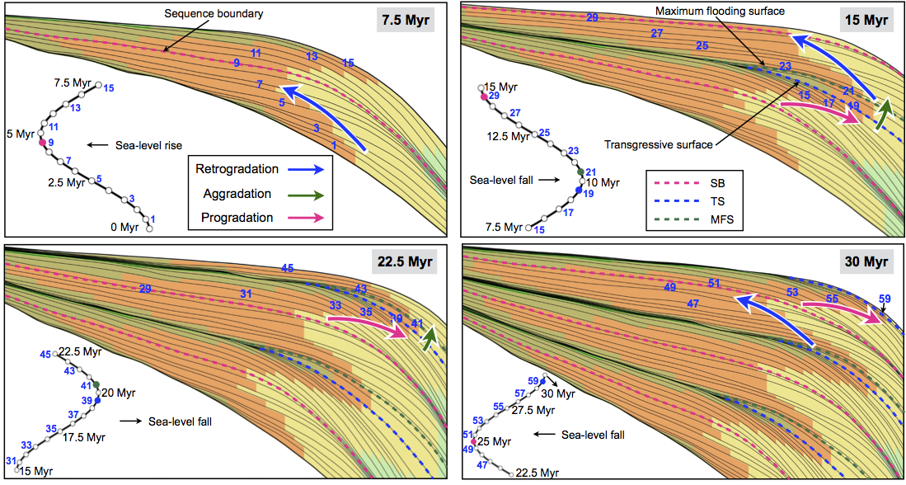

###################
Usage
###################

Portability
--------------

**Badlands** is an open-source package distributed under **GNU GPLv3 license**. The source code is available on `GitHub`_. Structurally the code is a *Python front end* with a *C* and *Fortran* middle layer to efficiently compute some of the heaviest functions. This Python-friendly version provides a programmable and flexible interface which maximises its portability across platforms.

.. _`GitHub`: https://github.com/badlands-model/badlands

.. tip::
  Instructions to install the code and the associated dependencies on a local system are provided in the next section of this documentation along with model options and a series of hands-on examples.

The easiest way to use **badlands** is via a *Docker container* (searching for *badlands-demo* on DockerHub or Kitematic) which is shipped with the complete list of dependencies, the model's companion, series of examples as well as workshop simulations.

.. caution::
  Models data and outputs ran from within the container will not persist when that container is no longer active.

To provide better interfacing between the container and the host filesystem, **badlands** image can be mounted on a local volume which allow for easy access and ability to store securely model results.

Interactions with other packages
--------------------------------

Triangulation
^^^^^^^^^^^^^

**Badlands** main calculations are performed on a TIN. However the code creates its own Delaunay triangulation using the Shewchuk’s Triangle library [1]_ from regularly defined input datasets (*e.g.*, topography grid, rain maps, tectonic maps). In that way, users provide standard regularly spaced *ASCII* datasets.

The only requirement is to follow a specific column-major order for the declaration of each nodes values which is consistent between imported datasets starting from the south-west and ending on the north-east corner.

Visualisation
^^^^^^^^^^^^^

Model results consist of time series of surface evolution, river and catchment dynamics grids as well as underlying stratigraphic architecture mesh. These outputs are all produced as **Hdf5 binary files** making it possible to interact with multiple existing visualisation and analysis software, such as Paraview_ or Visit_.

.. _Paraview: http://www.paraview.org
.. _Visit: https://wci.llnl.gov/simulation/computer-codes/visit/

Initial surface can be generated from UTM coordinates and functions have been added to easily extract Web Map Service dataset (one example is provided to illustrate how to define an initial topography grid from ETOPO5 datasets). Hdf5 files can also be quickly transformed in other conventional raster GIS file formats such as ASCII grids.

Flexural isostasy
^^^^^^^^^^^^^^^^^

To estimate flexural isostasy, *gFlex* modular python package [2]_ has been integrated as a component in **badlands**. It allows to compute isostatic deflections of Earth’s lithosphere with uniform or nonuniform flexural rigidity and couple the interactions with evolving surface loads induced by erosion and deposition associated to modelled surface processes.

.. Note::
      Flexural isostasy is obtained from the gflex_ package available on Github |:bomb:|

.. _gflex: https://github.com/awickert/gFlex

Geodynamic models
^^^^^^^^^^^^^^^^^

.. image:: img/collision_wedge.gif
   :scale: 100 %
   :alt: capability
   :align: center

uwgeodynamics_ [3]_ provides a way to couple an **underworld** model to **badlands**.

.. _uwgeodynamics: https://github.com/underworldcode/UWGeodynamics

.. code:: python

  import UWGeodynamics as GEO

  u = GEO.u
  air = GEO.Material()
  sediment = GEO.Material()
  Model.surfaceProcesses = GEO.surfaceProcesses.Badlands(
    airIndex=[air.index], sedimentIndex=sediment.index,
    XML="resources/badlands.xml", resolution=1. * u.kilometre,
    checkpoint_interval=0.01 * u.megayears)

This will allow communication between the **uwgeodynamics** model and **badlands**. As in every **badlands** simulation, input parameters must be defined inside the *XML* file as described in this documentation.

.. role:: python(code)
    :language: py

The resulting :python:`Model` is a 2-way coupled thermo-mechanical model with surface processes, where the velocity field retrieved from the thermo-mechanical model is used to advect the surface in **badlands**. The surface in subject to both erosion and deposition. The distribution of materials in the thermo-mechanical (**underworld**) model is then updated.

.. important::
  It is recommended to use a higher spatial resolution in the surface processes model than in the thermo-mechanical model.

Users must define a list of material describing the air layers (usually, air and sticky air). It is also require to define an :python:`UWGeodynamics.Material` object describing the sediment that will be deposited. The index of the :python:`Material` is passed to the :python:`surfaceProcesses` function. Users can also provide an **underworld** function returning an index of an existing :python:`UWGeodynamics.Material`.

.. note::
  When the thermo-mechanical model is **2D**, the velocity field at the surface is extrapolated in the 3D dimension and the resulting model is a **T** or **2.5D** model (symmetric regional uplift). If the thermo-mechanical model is 3D the coupling is done in 3D.

Hands-on examples
-----------------

A series of examples are available with the source code. These examples illustrate the different capabilities of the code and are an ideal starting point to learn how to use **badlands**. Each folder is composed of

1. an input XML file where the different options for the considered experiment are set,
2. a data folder containing the initial surface and potentially some forcing files (e.g. sea-level, rainfall or tectonic grids) and
3. a series of IPython notebooks used to run the experiment and perform some pre or post-processing tasks.

.. tip::
  These examples have been designed to be run quickly and should take on average 5 minutes on standard computer.

.. list-table:: Summary of hands-on examples provided with **badlands** package. Abbreviations: dim.: model dimension – rain uni./oro.: uniform or orographic – res.: model resolution – fluv.: fluvial processes – hillslp.: hillslope – strat.: stratigraphic architecture – s.l.: sea-level – tect.: tectonics.
   :widths: 15 15 15 15 30
   :header-rows: 1

   * - Exp.
     - dim. [km]
     - res.
     - time
     - Forcings & Processes
   * - Basin
     - 30 x 30
     - 100 m
     - 1 Ma
     - Rain uni.   |  Fluv./hillslp.   |   s.l.  |  Strat.
   * - Crater
     - 2.5 x 2.5
     - 10 m
     - 200 ka
     - Rain uni.   |       Fluv./hillslp.
   * - Delta
     - 25 x 25
     - 50 m
     - 500 ka
     - Rain uni.   |   Fluv./hillslp.   |   s.l.     | tect.    |  Strat.
   * - Dyntopo
     - 300 x 200
     - 1 km
     - 10 Ma
     - Rain uni.   |   Fluv./hillslp.   |   s.l.
   * - eTopo
     - 133 x 180
     - 50 m
     - 500 ka
     - Rain uni.   |   Fluv./hillslp.   |   s.l.   | tect.
   * - Flexure
     - 250 x 100
     - 500 m
     - 1 Ma
     - Rain uni.   |   Fluv./hillslp.   |   gflex_
   * - Mountain
     - 80 x 40
     - 400 m
     - 10 Ma
     - Rain oro.    |  Fluv./hillslp.
   * - Rift
     - 400 x 400
     - 2 km
     - 250 ka
     - Rain uni.    |    Fluv./hillslp.   |   3D tect.
   * - Strikeslip
     - 200 x 200
     - 1 km
     - 100 ka
     - Rain uni.    |    Fluv./hillslp.   |   3D tect.

The range of simulations varies both in term of spatial and temporal resolutions. A summary of the proposed models is presented in Table 1 and could serve as a basis for more complex problems. You can browse the list of examples directly from the IPython notebooks.

Companion
-----------------

To assist users during the pre and post-processing phases, a series of Python classes are proposed in a GitHub badlands-companion repository. These classes are shipped with the Docker container mentioned in previous section. In addition, IPython notebooks have been created to illustrate how these python classes are used. We have chosen this structure to give users the transparency and opportunity to

1. clearly understand the creation and format of the input files,
2. perform quantitative analyses of **badlands** output files,
3. easily design their own notebooks and further improve the proposed workflow.

Pre-processing classes
^^^^^^^^^^^^^^^^^^^^^^

The pre-processing notebooks allows for quick creation of grids and files compatible with **badlands** input format. The main functionalities and associated notebook filenames are listed below:

+ topographic grids for generic model (topoCreate),
+ real topographic/bathymetric dataset (etopoGen),
+ building sea level fluctuations curve or using Haq curve (seaLevel),
+ horizontal displacement and precipitation maps (topoTec),
+ regridding initial tectonic, rainfall and topographic input files (regridInput)

Post-processing classes
^^^^^^^^^^^^^^^^^^^^^^^

+------------------------------+
| Morphometric & Hydrometric   |
+------------------------------+

The morphometrics notebook can be used to perform quantitative analyses of simulated **badlands** landforms [4]_ [5]_. Gradients, curvature (horizontal and vertical), aspect and discharge attributes can be extracted for the entire region or a specific area of the simulation. The hydrometric notebook allows for evaluation of time dependent evolution of a specific catchment. It can be used to quantify the longitudinal evolution of a river profile, compute the Peclet number distribution, χ-maps as well as hypsometric curves.

+---------------------------------+
| Stratigraphy & Wheeler diagram  |
+---------------------------------+

.. figure:: img/fig7_new.png
   :scale: 45 %
   :alt: capability
   :align: center

   Predicted stratal architecture. (a) Stratal stacking patterns on a vertical cross-section. Solid black lines shown on each subplot are stratigraphic layers and are plotted at 0.5 Myr intervals. The coupled sea-level scenario is modelled as a sinusoidal curve. Different colours stand for different depositional environments that are defined based on water depth. (b) Wheeler diagram or chronostratigraphy chart. The black dots are shoreline positions through time, or shoreline trajectory. The coloured dashed lines are stratigraphic surfaces identified based on stratal terminations, stacking trends and shoreline trajectory. (c) Virtual cores extracted at different positions: P1, P2, P3, P4, P5. Solid lines connect condensed sections that are associated with unconformity due to sea-level fall.

When the stratigraphic structure is turned on in pyBadlands, it is possible to extract cross-section and plot stratigraphic layers (Fig 8a), Wheeler diagram (Fig 8b) and virtual cores (Fig 8c). The notebook extracts simulated depositional sequences on a vertical cross-section, and calculates the relative sea level change, shoreline trajectory, accommodation and sedimentation change (Fig 8). Three methods can be applied to interpret the stratigraphic units including

+ the systems tracts model based on relative sea level change,
+ the shoreline trajectory analysis [6]_ and
+ the accommodation succession method [7]_ [8]_.

Using the stratalMesh notebook, it is also possible to export the simulated stratigraphy as a VTK structured mesh that could be further analysed in other software packages.

----------

.. [1] J. R. Shewchuk -
  Triangle: Engineering a 2D quality mesh generator and Delaunay triangulator, pp. 203–222. Berlin, Heidelberg: Springer Berlin Heidelberg, 1996.

.. [2] A. D. Wickert -
  Open-source modular solutions for flexural isostasy: gflex v1.0, Geoscientific Model Development, vol. 9, no. 3, pp. 997–1017, 2016.

.. [3] Beucher et al. -
  UWGeodynamics: A teaching and research tool for numerical geodynamic modelling. Journal of Open Source Software, 4(36), 1136, `doi:10.21105/joss.01136`_, 2019.

.. [4] T. Salles and L. Hardiman -
  Badlands: An open-source, flexible and parallel framework to study landscape dynamics, Computers & Geosciences, vol. 91, no. Supplement C, pp. 77–89, 2016.

.. [5] T. Salles, N. Flament, and D. Müller -
  Influence of mantle flow on the drainage of eastern Australia since the jurassic period, Geochemistry, Geophysics, Geosystems, vol. 18, no. 1, pp. 280–305, 2017.

.. [6] W. Helland-Hansen and G. Hampson -
  Trajectory analysis: concepts and applications, Basin Research, vol. 21, no. 5, pp. 454–483, 2009.

.. [7] J. Neal and V. Abreu -
  Sequence stratigraphy hierarchy and the accommodation succession method, Geology, vol. 37, no. 9, pp. 779–782, 2009.

.. [8] J. E. Neal, V. Abreu, K. M. Bohacs, H. R. Feldman, and K. H. Pederson -
 Accommodation succession (δa/δs) sequence stratigraphy: observational method, utility and insights into sequence boundary formation, Journal of the Geological Society, vol. 173, no. 5, pp. 803–816, 2016.

.. _`doi:10.21105/joss.01136`: https://doi.org/10.21105/joss.01136
